<div align="center">

# 🏓 Transcendence

### *Real-time Multiplayer Pong Platform*


### ⚡ Features

🎮 **Real-time Pong** • 🤖 **AI Opponent** • 🏆 **Tournaments** • 💬 **Live Chat** • 👥 **Social System** 

🔐 **2FA Security** • 🌐 **OAuth Login** • 📊 **Statistics** • 🎯 **Matchmaking** • 👑 **Admin Panel**

</div>

---

## 📋 Table of Contents

- [🎯 About](#-about)
- [🏗️ Architecture](#️-architecture)
- [✨ Features](#-features)
- [🛠️ Tech Stack](#️-tech-stack)
- [✅ Prerequisites](#-prerequisites)
- [📦 Installation](#-installation)
- [🚀 Usage](#-usage)
- [📂 Project Structure](#-project-structure)
- [🎮 Game Modes](#-game-modes)
- [💬 Chat System](#-chat-system)
- [🔐 Security Features](#-security-features)
- [🌐 API Documentation](#-api-documentation)
- [🔧 Configuration](#️-configuration)
- [🧪 Testing](#-testing)
- [🔧 Troubleshooting](#-troubleshooting)

---

## 🎯 About

**Transcendence** is the final project of the 42 School common core curriculum. It's a full-stack, real-time multiplayer Pong game platform with comprehensive social features, tournament management, and advanced security implementations.

This single-page application combines modern web technologies to deliver a seamless gaming experience with:
- Real-time gameplay using WebSocket connections
- Secure authentication with OAuth and Two-Factor Authentication
- Live chat system with direct messaging and channels
- Tournament organization and bracket management
- Friend system with real-time status updates
- Comprehensive user statistics and leaderboards

### 🎓 Learning Objectives

- Building production-ready full-stack applications
- Real-time communication with WebSockets
- Advanced authentication and security practices
- Database design and ORM usage
- Docker containerization and orchestration
- Modern TypeScript development
- State management and routing in SPAs
- API design and RESTful principles

---

## 🏗️ Architecture

### System Overview

```mermaid
graph TB
    subgraph Client["🌐 Client Layer"]
        Browser[👤 Browser]
        Frontend[⚛️ Frontend SPA<br/>TypeScript + Vanilla JS<br/>WebSocket Client]
    end
    
    subgraph Gateway["🔐 Gateway Layer"]
        NGINX[🛡️ NGINX<br/>Reverse Proxy<br/>TLS/SSL<br/>Port: 8443]
    end
    
    subgraph Backend["🎮 Backend Services"]
        API[🚀 Fastify Server<br/>REST API<br/>Port: 3000]
        WS[⚡ WebSocket Server<br/>Real-time Events<br/>Game Engine]
        Session[🔑 Session Manager<br/>JWT + Cookies]
    end
    
    subgraph Features["📦 Feature Modules"]
        Auth[🔐 Authentication<br/>OAuth + 2FA]
        Game[🎮 Game Engine<br/>Pong Logic<br/>AI Player]
        Chat[💬 Chat System<br/>DM + Channels]
        Social[👥 Social Features<br/>Friends<br/>Profiles]
        Tournament[🏆 Tournaments<br/>Brackets<br/>Scheduling]
        Admin[👑 Admin Panel<br/>User Management]
    end
    
    subgraph Data["💾 Data Layer"]
        DB[(🗄️ SQLite Database<br/>Users<br/>Games<br/>Messages)]
        Files[📁 File Storage<br/>Avatars<br/>Assets]
    end
    
    Browser --> Frontend
    Frontend -->|HTTPS| NGINX
    NGINX -->|Proxy| API
    NGINX -->|Proxy| WS
    
    API --> Session
    API --> Auth
    API --> Game
    API --> Chat
    API --> Social
    API --> Tournament
    API --> Admin
    
    WS --> Game
    WS --> Chat
    WS --> Social
    
    Auth --> DB
    Game --> DB
    Chat --> DB
    Social --> DB
    Tournament --> DB
    Admin --> DB
    
    Frontend -.->|Upload| Files
    
    style Browser fill:#3498db,stroke:#2980b9,stroke-width:2px,color:#fff
    style Frontend fill:#61dafb,stroke:#21a1c4,stroke-width:2px,color:#000
    style NGINX fill:#009639,stroke:#006428,stroke-width:3px,color:#fff
    style API fill:#000000,stroke:#333,stroke-width:2px,color:#fff
    style WS fill:#010101,stroke:#333,stroke-width:2px,color:#fff
    style DB fill:#003545,stroke:#002030,stroke-width:2px,color:#fff
    style Game fill:#e74c3c,stroke:#c0392b,stroke-width:2px,color:#fff
    style Chat fill:#9b59b6,stroke:#8e44ad,stroke-width:2px,color:#fff
    style Auth fill:#2ecc71,stroke:#27ae60,stroke-width:2px,color:#fff
```



### Request Flow

**User Authentication:**
```
Browser → NGINX → Fastify → OAuth Provider → Session Creation → JWT Token
```

**Real-time Game:**
```
Frontend → WebSocket → Game Engine → State Update → Broadcast → All Clients
```

**Chat Message:**
```
User Input → WebSocket → Chat Handler → DB Storage → Broadcast → Recipients
```

---

## ✨ Features

### 🎮 Gaming Features

| Feature | Description |
|---------|-------------|
| **Classic Pong** | Traditional 1v1 Pong gameplay with smooth physics |
| **AI Opponent** | Single-player mode with intelligent AI opponent |
| **Remote Multiplayer** | Real-time online matches with other players |
| **Tournament Mode** | Organized brackets with multiple rounds |
| **Game Invites** | Send and accept game invitations |
| **Matchmaking** | Quick match with available players |
| **Live Spectating** | Watch ongoing matches in real-time |

### 💬 Social Features

- **Live Chat System**
  - Direct messages (DMs)
  - Public and private channels
  - Real-time message delivery
  - Message history and persistence
  
- **Friend System**
  - Send/accept friend requests
  - Friend list management
  - Real-time online status
  - Friend profiles and statistics

- **User Profiles**
  - Customizable avatars
  - Personal statistics
  - Match history
  - Achievement display
  - Ranking and leaderboard position

### 🔐 Authentication & Security

- **Multiple Login Methods**
  - GitHub OAuth integration
  - Traditional username/password
  - Password reset via email
  
- **Two-Factor Authentication (2FA)**
  - TOTP-based authentication
  - QR code generation
  - Backup codes
  
- **Session Management**
  - Secure JWT tokens
  - HTTP-only cookies
  - Session expiration
  - Multi-device support

### 🏆 Tournament System

- **Tournament Creation**
  - Customizable bracket sizes (4, 8, 16 players)
  - Public and private tournaments
  - Scheduled start times
  
- **Tournament Management**
  - Automatic bracket generation
  - Real-time updates
  - Winner tracking
  - Tournament history

### 👑 Admin Panel

- **User Management**
  - User list and search
  - Account status control
  - Role assignment
  - Activity monitoring
  
- **News Management**
  - Create announcements
  - Edit and delete posts
  - Publish/unpublish control

### 📊 Statistics & Leaderboards

- Win/Loss records
- Match history
- Global rankings
- Achievement tracking
- Performance metrics

### 🛡️ GDPR Compliance

- Data export functionality
- Account deletion
- Privacy controls
- Consent management

---

## 🛠️ Tech Stack

### Frontend

| Technology | Purpose |
|------------|---------|
| **TypeScript** | Type-safe JavaScript development |
| **Vanilla JS** | Lightweight SPA implementation |
| **Custom Router** | Client-side routing without frameworks |
| **WebSocket API** | Real-time bidirectional communication |
| **CSS3** | Modern styling and animations |

### Backend

| Technology | Purpose |
|------------|---------|
| **Fastify** | High-performance Node.js web framework |
| **TypeScript** | Type-safe server-side development |
| **WebSocket** | Real-time game and chat engine |
| **JWT** | Secure token-based authentication |
| **Bcrypt** | Password hashing |
| **Nodemailer** | Email functionality |
| **Speakeasy** | 2FA TOTP generation |

### Database & ORM

| Technology | Purpose |
|------------|---------|
| **SQLite** | Embedded relational database |
| **Custom ORM** | Type-safe database operations |
| **Migrations** | Schema version control |

### Infrastructure

| Technology | Purpose |
|------------|---------|
| **Docker** | Containerization |
| **Docker Compose** | Multi-container orchestration |
| **NGINX** | Reverse proxy and SSL termination |
| **Self-signed Certs** | HTTPS encryption |

### Development Tools

- **Git** - Version control
- **Make** - Build automation
- **ESLint** - Code linting
- **Prettier** - Code formatting

---

## ✅ Prerequisites

- **Docker** (version 20.10+)
- **Docker Compose** (version 2.0+)
- **Git**
- **Make** (optional, for convenience)
- **Modern Web Browser** (Chrome, Firefox, Safari, Edge)

### System Requirements

- **RAM**: Minimum 2GB available
- **Disk Space**: At least 5GB free
- **Network**: Internet connection for OAuth and email features

---

## 📦 Installation

### 1. Clone the Repository

```bash
git clone https://github.com/yourusername/Transcendence.git
cd Transcendence
```

### 2. Configure Environment Variables

Create a `.env` file in the `backend/` directory:

```bash
cp backend/.env.example backend/.env
```

Edit `backend/.env` with your configuration:

```env
# JWT Secret (generate a random string)
JWT_SECRET="your-secret-key-here"

# GitHub OAuth (get from https://github.com/settings/developers)
GITHUB_CLIENT_ID=your_github_client_id
GITHUB_CLIENT_SECRET=your_github_client_secret
GITHUB_REDIRECT_URI=https://localhost:8443/api/oauth/github/callback

# SMTP Configuration (for email features)
SMTP_HOST=smtp.gmail.com
SMTP_PORT=587
SMTP_USER=your-email@gmail.com
SMTP_PASS=your-app-password
SMTP_FROM="PongSocial <no-reply@yourapp.com>"

# Frontend URL
FRONTEND_URL=https://localhost:8443

# Database
DATABASE_PATH=./data/app.db
```

### 3. Generate SSL Certificates

```bash
# Run the certificate generation script
./scripts/generate-certs.sh

# Or using Make
make certs
```

### 4. Build and Start the Application

```bash
# Using Docker Compose
docker-compose up --build

# Or using Make
make up
```

The application will be available at: **https://localhost:8443**

---

## 🚀 Usage

### Starting the Application

```bash
# Build and start all services
make up

# Start in detached mode
make up-detached

# View logs
make logs

# Follow logs for a specific service
docker-compose logs -f frontend
docker-compose logs -f backend
```

### Stopping the Application

```bash
# Stop all services
make down

# Stop and remove volumes
make clean

# Complete cleanup
make fclean
```

### Development Mode

```bash
# Start with hot reload
make dev

# Rebuild after changes
make rebuild
```

### Accessing the Application

1. Open your browser and navigate to: **https://localhost:8443**
2. Accept the self-signed certificate warning
3. Register a new account or login with OAuth
4. Start playing!

---

## 📂 Project Structure

```
Transcendence/
├── docker-compose.yml              # Service orchestration
├── Makefile                        # Build automation
├── README.md                       # This file
│
├── backend/                        # Backend service
│   ├── Dockerfile                  # Backend container config
│   ├── package.json                # Node.js dependencies
│   ├── tsconfig.json               # TypeScript configuration
│   ├── .env                        # Environment variables (gitignored)
│   │
│   └── src/
│       ├── server.ts               # Application entry point
│       │
│       ├── controllers/            # Route handlers
│       │   ├── auth.ts            # Authentication logic
│       │   ├── oauth.ts           # OAuth integration
│       │   ├── twoFactor.ts       # 2FA implementation
│       │   ├── users.ts           # User management
│       │   ├── friends.ts         # Friend system
│       │   ├── tournaments.ts     # Tournament logic
│       │   ├── admin.ts           # Admin operations
│       │   ├── gdpr.ts            # GDPR compliance
│       │   └── news.ts            # News management
│       │
│       ├── models/                 # Database layer
│       │   ├── connection.ts      # Database connection
│       │   ├── init.ts            # Schema initialization
│       │   ├── index.ts           # Model exports
│       │   │
│       │   └── schemas/           # Database schemas
│       │       ├── users.ts       # User table
│       │       ├── social.ts      # Friends & relationships
│       │       ├── chat.ts        # Messages & channels
│       │       ├── gaming.ts      # Games & matches
│       │       └── news.ts        # News & announcements
│       │
│       ├── websocket/              # WebSocket handlers
│       │   ├── router.ts          # WS route dispatcher
│       │   ├── utils.ts           # WS utilities
│       │   │
│       │   └── handlers/          # Event handlers
│       │       ├── auth.ts        # WS authentication
│       │       ├── game.ts        # Game engine
│       │       ├── remoteGame.ts  # Multiplayer logic
│       │       ├── chat.ts        # Chat events
│       │       ├── friends.ts     # Friend events
│       │       ├── invites.ts     # Game invites
│       │       └── status.ts      # User status
│       │
│       ├── services/               # Business logic
│       │   └── twoFactorService.ts # 2FA utilities
│       │
│       ├── plugins/                # Fastify plugins
│       │   └── session.ts         # Session management
│       │
│       ├── routes/                 # Route definitions
│       │   └── messages.ts        # Message routes
│       │
│       ├── utils/                  # Utilities
│       │   └── websocket.ts       # WS helpers
│       │
│       └── types/                  # TypeScript types
│           └── fastify.d.ts       # Type declarations
│
├── frontend/                       # Frontend service
│   ├── Dockerfile                  # Frontend container config
│   ├── package.json                # Frontend dependencies
│   ├── tsconfig.json               # TypeScript configuration
│   │
│   ├── nginx/                      # NGINX configuration
│   │   ├── nginx.conf             # Main config
│   │   └── default.conf           # Site config
│   │
│   ├── public/                     # Static assets
│   │
│   └── src/
│       ├── index.html             # Application entry
│       ├── main.ts                # TypeScript entry point
│       ├── router.ts              # Client-side routing
│       │
│       ├── pages/                  # Page components
│       │   ├── auth.ts            # Login/Register
│       │   ├── profile.ts         # User profile
│       │   ├── profileSetup.ts    # Initial setup
│       │   ├── game.ts            # Game lobby
│       │   ├── aiGame.ts          # AI mode
│       │   ├── remoteGame.ts      # Multiplayer
│       │   ├── tournaments.ts     # Tournament list
│       │   ├── tournamentDetail.ts # Tournament view
│       │   ├── friends.ts         # Friend list
│       │   ├── friendProfile.ts   # Friend details
│       │   ├── settings.ts        # User settings
│       │   ├── leaderboard.ts     # Rankings
│       │   ├── admin.ts           # Admin panel
│       │   ├── forgot.ts          # Password reset
│       │   └── oauthSuccess.ts    # OAuth callback
│       │
│       ├── components/             # Reusable components
│       │   ├── auth/              # Auth components
│       │   │   ├── oauthButtons.ts
│       │   │   └── twoFactorSetup.ts
│       │   │
│       │   ├── game/              # Game components
│       │   │   ├── game.ts
│       │   │   ├── pongGame.ts
│       │   │   ├── aiPongGame.ts
│       │   │   ├── remotePongGame.ts
│       │   │   ├── tournamentGame.ts
│       │   │   └── remoteGameInvite.ts
│       │   │
│       │   ├── chat/              # Chat components
│       │   │   └── chat.ts
│       │   │
│       │   ├── friends/           # Social components
│       │   │   ├── friendList.ts
│       │   │   └── friendRequests.ts
│       │   │
│       │   ├── profile/           # Profile components
│       │   │   └── AvatarUpload.ts
│       │   │
│       │   ├── stats/             # Statistics
│       │   │   └── userStats.ts
│       │   │
│       │   ├── gdpr/              # GDPR components
│       │   │   └── GDPRManagement.ts
│       │   │
│       │   ├── layout/            # Layout components
│       │   │   └── LeftSidebar.ts
│       │   │
│       │   └── ui/                # UI components
│       │       ├── ui.ts
│       │       ├── notifications.ts
│       │       └── NotificationDropdown.ts
│       │
│       ├── services/               # Frontend services
│       │   ├── api.ts             # HTTP client
│       │   ├── auth.ts            # Auth service
│       │   ├── socket.ts          # WebSocket client
│       │   ├── config.ts          # Configuration
│       │   ├── eventBus.ts        # Event system
│       │   └── notificationRefresh.ts
│       │
│       ├── stores/                 # State management
│       │   ├── authState.ts       # Auth state
│       │   ├── friendState.ts     # Friend state
│       │   └── notificationStore.ts
│       │
│       └── types/                  # TypeScript types
│           └── user.ts            # User types
│
└── scripts/                        # Utility scripts
    └── generate-certs.sh          # SSL certificate generator
```

---

## 🎮 Game Modes

### 1. AI Game (Single Player)

Play against an intelligent AI opponent with adjustable difficulty.

```
Navigate to: Game → Play AI
- Choose difficulty level
- Practice your skills
- No internet required
```

### 2. Remote Game (Multiplayer)

Challenge other online players in real-time matches.

```
Navigate to: Game → Play Online
- Send game invites to friends
- Accept incoming invitations
- Real-time competitive play
- Live score tracking
```

### 3. Tournament Mode

Compete in organized tournaments with multiple players.

```
Navigate to: Tournaments
- Join existing tournaments
- Create your own tournament
- Track bracket progression
- Win the championship
```

### Game Controls

| Key | Action |
|-----|--------|
| `W` | Move paddle up (Player 1) |
| `S` | Move paddle down (Player 1) |
| `↑` | Move paddle up (Player 2) |
| `↓` | Move paddle down (Player 2) |
| `Space` | Pause/Resume game |

---

## 💬 Chat System

### Features

- **Direct Messages**: Private 1-on-1 conversations
- **Channels**: Group conversations with multiple users
- **Real-time Delivery**: Instant message transmission
- **Message History**: Persistent chat logs
- **Online Status**: See who's currently active

### Usage

```
1. Click the chat icon in the sidebar
2. Select a friend or channel
3. Type your message
4. Press Enter to send
```

---

## 🔐 Security Features

### Authentication Security

- **Password Hashing**: Bcrypt with salt rounds
- **JWT Tokens**: Secure, signed tokens
- **HTTP-only Cookies**: XSS protection
- **CSRF Protection**: Token validation
- **Session Expiration**: Automatic timeout

### Two-Factor Authentication

1. **Setup**:
   - Navigate to Settings → Security
   - Enable 2FA
   - Scan QR code with authenticator app
   - Save backup codes

2. **Login with 2FA**:
   - Enter username/password
   - Provide TOTP code from authenticator
   - Successful authentication

### OAuth Integration

- GitHub OAuth for simplified login
- Secure token exchange
- Profile data synchronization
- Optional email verification

---

## 🌐 API Documentation

### REST API Endpoints

#### Authentication

```http
POST   /api/auth/register          # Register new user
POST   /api/auth/login             # Login with credentials
POST   /api/auth/logout            # Logout current session
POST   /api/auth/forgot-password   # Request password reset
POST   /api/auth/reset-password    # Reset password with token
GET    /api/auth/me                # Get current user info
```

#### OAuth

```http
GET    /api/oauth/github           # Initiate GitHub OAuth
GET    /api/oauth/github/callback  # OAuth callback handler
```

#### Two-Factor Authentication

```http
POST   /api/2fa/setup              # Generate 2FA secret
POST   /api/2fa/verify             # Verify 2FA code
POST   /api/2fa/disable            # Disable 2FA
```

#### Users

```http
GET    /api/users                  # Get all users
GET    /api/users/:id              # Get user by ID
PUT    /api/users/:id              # Update user profile
DELETE /api/users/:id              # Delete user account
POST   /api/users/avatar           # Upload avatar
```

#### Friends

```http
GET    /api/friends                # Get friend list
POST   /api/friends/request        # Send friend request
POST   /api/friends/accept         # Accept friend request
DELETE /api/friends/:id            # Remove friend
```

#### Tournaments

```http
GET    /api/tournaments            # Get all tournaments
POST   /api/tournaments            # Create tournament
GET    /api/tournaments/:id        # Get tournament details
POST   /api/tournaments/:id/join   # Join tournament
```

### WebSocket Events

#### Connection

```javascript
// Connect to WebSocket
const socket = new WebSocket('wss://localhost:8443/ws');

// Authentication
socket.send(JSON.stringify({
  type: 'auth',
  token: 'your-jwt-token'
}));
```

#### Game Events

```javascript
// Join game
{ type: 'game:join', gameId: 'uuid' }

// Move paddle
{ type: 'game:move', direction: 'up' | 'down' }

// Game state update (from server)
{ type: 'game:update', state: {...} }
```

#### Chat Events

```javascript
// Send message
{ type: 'chat:message', to: 'userId', message: 'Hello!' }

// Receive message (from server)
{ type: 'chat:received', from: 'userId', message: 'Hi!' }
```

#### Friend Events

```javascript
// Status update (from server)
{ type: 'friend:status', userId: 'uuid', status: 'online' }
```

---

## ⚙️ Configuration

### Backend Configuration

Edit `backend/.env`:

```env
# Server
PORT=3000
NODE_ENV=production

# Security
JWT_SECRET=your-secret-key
JWT_EXPIRATION=7d

# Database
DATABASE_PATH=./data/app.db

# Email (SMTP)
SMTP_HOST=smtp.gmail.com
SMTP_PORT=587
SMTP_USER=your-email@gmail.com
SMTP_PASS=your-app-password

# OAuth
GITHUB_CLIENT_ID=your_client_id
GITHUB_CLIENT_SECRET=your_client_secret
GITHUB_REDIRECT_URI=https://localhost:8443/api/oauth/github/callback

# Frontend
FRONTEND_URL=https://localhost:8443
```

### Frontend Configuration

Edit `frontend/nginx/default.conf` for custom routing or caching rules.

### Docker Configuration

Edit `docker-compose.yml` to modify:
- Port mappings
- Volume mounts
- Environment variables
- Service dependencies

---

## 🧪 Testing

### Manual Testing

```bash
# Start the application
make up

# Test authentication
curl -X POST https://localhost:8443/api/auth/register \
  -H "Content-Type: application/json" \
  -d '{"username":"testuser","email":"test@example.com","password":"Test123!"}'

# Test protected endpoint
curl -X GET https://localhost:8443/api/auth/me \
  -H "Authorization: Bearer your-jwt-token"
```

### WebSocket Testing

```javascript
// Open browser console at https://localhost:8443
const ws = new WebSocket('wss://localhost:8443/ws');
ws.onmessage = (event) => console.log('Received:', event.data);
ws.send(JSON.stringify({ type: 'ping' }));
```

### Browser Testing

1. Register multiple accounts
2. Test friend requests between accounts
3. Start a game and verify real-time updates
4. Send chat messages
5. Create and join tournaments

---

## 🔧 Troubleshooting

### Common Issues

#### Cannot Connect to Backend

```bash
# Check if backend is running
docker-compose ps

# View backend logs
docker-compose logs backend

# Restart backend
docker-compose restart backend
```

#### WebSocket Connection Failed

```bash
# Verify NGINX is proxying WebSocket correctly
docker-compose logs nginx

# Check browser console for errors
# Ensure you're using wss:// (not ws://) for HTTPS sites
```

#### Database Errors

```bash
# Reset database
docker-compose down -v
docker-compose up --build

# Or manually remove database
rm -rf backend/data/app.db
```

#### SSL Certificate Issues

```bash
# Regenerate certificates
./scripts/generate-certs.sh

# Restart services
docker-compose restart
```

#### OAuth Not Working

1. Verify GitHub OAuth credentials in `.env`
2. Check redirect URI matches GitHub app settings
3. Ensure `FRONTEND_URL` is correct in `.env`

#### Port Already in Use

```bash
# Check what's using port 8443
lsof -i :8443

# Kill the process or change port in docker-compose.yml
docker-compose down
# Edit docker-compose.yml port mapping
docker-compose up
```

### Logging

```bash
# View all logs
make logs

# Follow specific service
docker-compose logs -f backend
docker-compose logs -f frontend

# View last 100 lines
docker-compose logs --tail=100 backend
```

### Debugging

```bash
# Access backend container
docker-compose exec backend sh

# Access frontend container
docker-compose exec frontend sh

# Inspect database
docker-compose exec backend sh
cd data
sqlite3 app.db
.tables
SELECT * FROM users;
```

---

## 📝 Additional Information

### Makefile Commands

```bash
make up          # Start all services
make down        # Stop all services
make restart     # Restart all services
make logs        # View logs
make clean       # Clean containers and volumes
make fclean      # Complete cleanup
make re          # Clean and rebuild
make certs       # Generate SSL certificates
```

---

<div align="center">

### 🎮 Built with passion for the 42 School Transcendence project

*Real-time Multiplayer • TypeScript • WebSocket • Docker*


**Play • Chat • Compete • Win**

</div>
